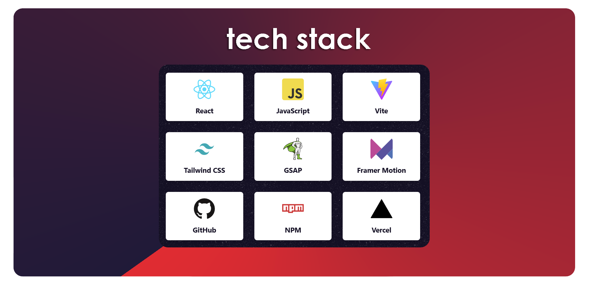
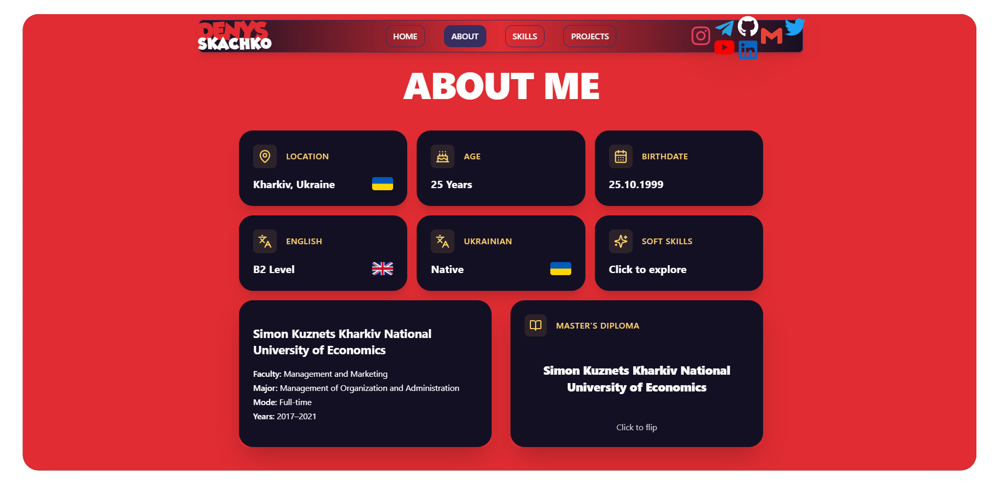
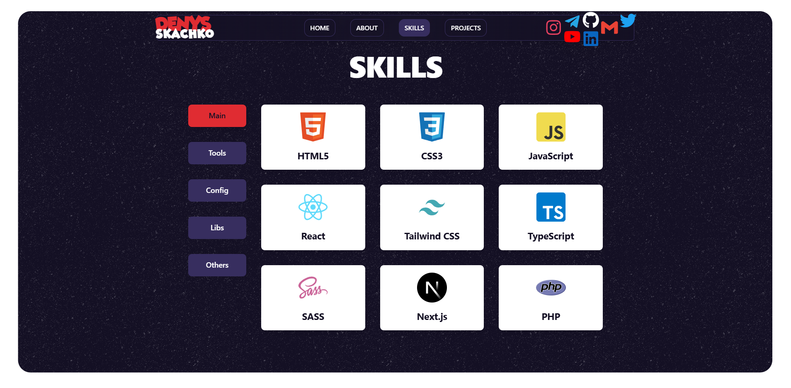
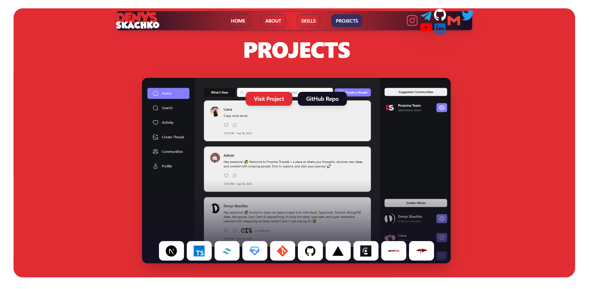
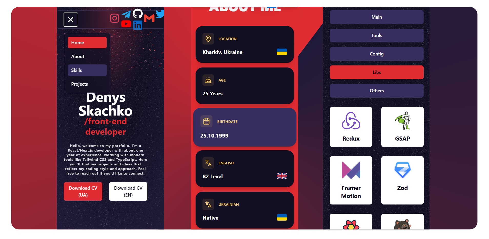

# Personal Portfolio — CV Website

## Overview

A personal portfolio and CV website showcasing skills, projects, and creative work.  
The site emphasizes performance, clean design, and fully responsive layouts.  
It contains 7–8 highlighted projects with links, a downloadable PDF CV, and custom interactive elements.

## Technology Stack

- React, JavaScript
- Vite
- Tailwind CSS
- GSAP, Framer Motion
- NPM
- Git, GitHub
- Vercel

## Screenshots

### About

### Skills

### Projects

### Mobile View

## Features

- **User Experience**
  - Custom preloader
  - Responsive design for desktop and mobile
  - Burger menu for smooth navigation

- **Animations & Interactivity**
  - Scroll-driven effects with GSAP ScrollTrigger
  - SplitText animated headings
  - Flip card components
  - Modal windows for additional content

- **Portfolio Essentials**
  - Integrated project showcase (7–8 featured works)
  - Downloadable PDF CV
